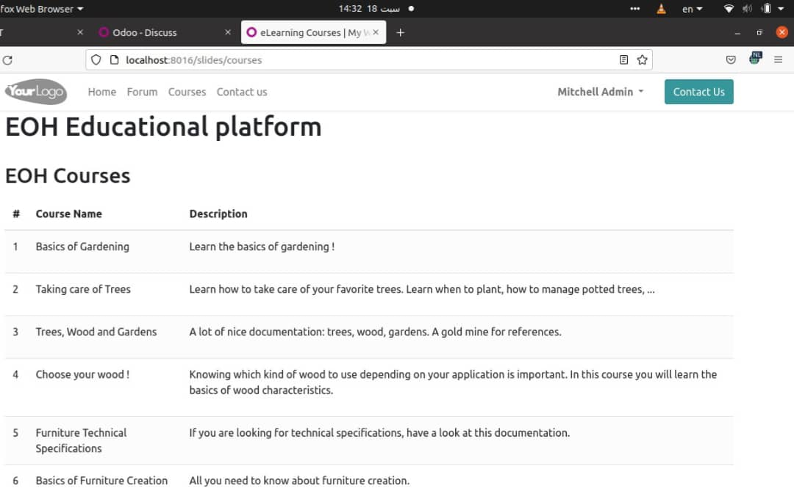

# EOH Educational Platform

An innovative e-learning solution built on Odoo, designed to make education accessible, engaging, and adaptable to modern learners.

## Our Story

EOH began with a simple yet powerful realization: education should be accessible, engaging, and adaptable to the needs of modern learners. As a lifelong learner, I believed that education shouldn't be confined to traditional classrooms or methods. The rapid pace of technological change made it clear that we needed a platform that could not only deliver content but also provide an interactive, dynamic experience.

Initially, I had heard about Odoo in the context of business applications. As I explored further, I realized it was much more than that—it had the potential to be the backbone of a modern e-learning platform. The eLearning module immediately caught my attention with its flexibility and seamless integration with Odoo's website builder.

## Key Features

- **Interactive Learning Modules**: Engage learners with dynamic content
- **Progress Tracking**: Monitor student performance in real-time
- **Collaborative Tools**: Facilitate communication between students and educators
- **Customizable Courses**: Tailor educational materials to diverse needs
- **Assessment System**: Streamline evaluation processes
- **User Authentication**: Secure login and data protection
- **Responsive Design**: Optimized for both mobile and desktop

## Technical Highlights

- Built on Odoo's robust framework
- Leverages Odoo's eLearning module
- Integrated with Odoo's website builder for a seamless user experience

## Current Technical Challenge

We are working on integrating Zoom into the Odoo eLearning module to enable scheduling and joining Zoom meetings directly from EOH courses. This integration poses challenges in handling the Zoom API appropriately and providing user feedback within Odoo.

## Installation

1. Install Odoo 16 on your server following the [official documentation](https://www.odoo.com/documentation/16.0/administration/install.html)
2. Clone this repository:git clone https://github.com/huzaifa250/EOH-Educational-Platform.git
3. Add the EOH module to your Odoo 16 addons path
4. Update the Odoo module list and install the EOH module

For detailed installation instructions, please refer to our [documentation](link-to-docs).

## Contributing

We welcome contributions to EOH! Whether it's improving documentation, adding new features, or reporting bugs, your help is appreciated. Please see our [contributing guidelines](link-to-contributing) for more information.

## Connect With Us

- [Huzaifa Elnaeem](https://www.linkedin.com/in/huzaifa-elnaeem-415042a6/)
- [Salma Mohammed](https://www.linkedin.com/in/salma-mohammed-3155a61a4/)

## License

This project is licensed under the MIT License - see the [LICENSE](link-to-license) file for details.
